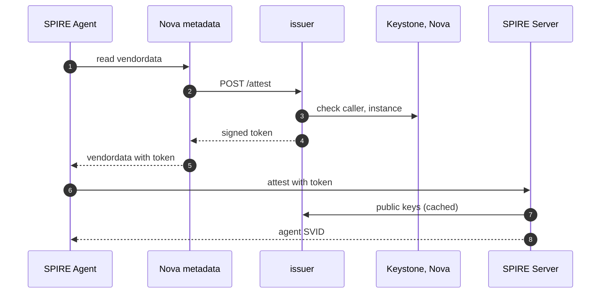

# Attestation overview

How an instance's SPIRE Agent gets its identity, in the three steps of the Setup Guide's introduction.

```mermaid
sequenceDiagram
    autonumber
    participant agent as SPIRE Agent
    participant meta as Nova metadata
    participant issuer as issuer
    participant os as Keystone, Nova
    participant server as SPIRE Server
    agent->>meta: read vendordata
    meta->>issuer: POST /attest
    issuer->>os: check caller, instance
    issuer-->>meta: signed token
    meta-->>agent: vendordata with token
    agent->>server: attest with token
    server->>issuer: public keys (cached)
    server-->>agent: agent SVID
```
