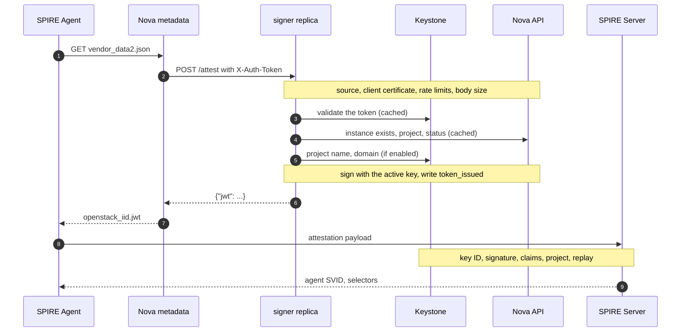

# Attestation sequence

The checks every step makes, from an instance's metadata read to its agent SVID.

```mermaid
sequenceDiagram
    autonumber
    participant agent as SPIRE Agent
    participant meta as Nova metadata
    participant issuer as signer replica
    participant ks as Keystone
    participant nova as Nova API
    participant server as SPIRE Server
    agent->>meta: GET vendor_data2.json
    meta->>issuer: POST /attest with X-Auth-Token
    Note over issuer,nova: source, client certificate, rate limits, body size
    issuer->>ks: validate the token (cached)
    issuer->>nova: instance exists, project, status (cached)
    issuer->>ks: project name, domain (if enabled)
    Note over issuer,nova: sign with the active key, write token_issued
    issuer-->>meta: {"jwt": ...}
    meta-->>agent: openstack_iid.jwt
    agent->>server: attestation payload
    Note over ks,server: key ID, signature, claims, project, replay
    server-->>agent: agent SVID, selectors
```
