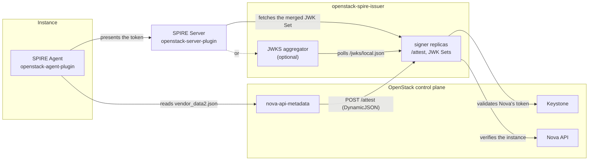

# Components

The solution's components and the calls between them.

```mermaid
flowchart LR
    subgraph guest["Instance"]
        agent["SPIRE Agent<br/>openstack-agent-plugin"]
    end
    subgraph control["OpenStack control plane"]
        meta["nova-api-metadata"]
        keystone["Keystone"]
        nova["Nova API"]
    end
    subgraph issuer["openstack-spire-issuer"]
        signer["signer replicas<br/>/attest, JWK Sets"]
        aggregator["JWKS aggregator<br/>(optional)"]
    end
    server["SPIRE Server<br/>openstack-server-plugin"]

    agent -- "reads vendor_data2.json" --> meta
    meta -- "POST /attest (DynamicJSON)" --> signer
    signer -- "validates Nova's token" --> keystone
    signer -- "verifies the instance" --> nova
    agent -- "presents the token" --> server
    server -- "fetches the merged JWK Set" --> signer
    server -. "or" .-> aggregator
    aggregator -- "polls /jwks/local.json" --> signer
```
