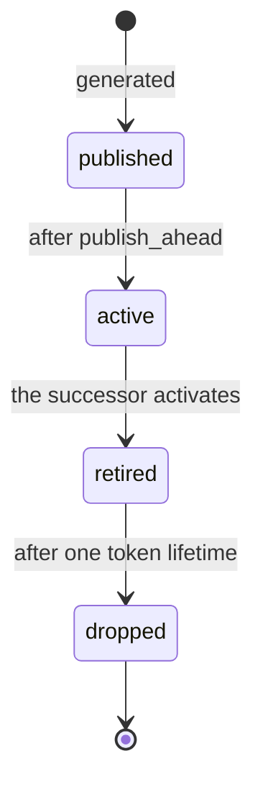

# Signing key lifecycle

Each signer replica's keys move through these states; every transition is an audit record (key_lifecycle).

```mermaid
stateDiagram-v2
    direction TB
    [*] --> published: generated
    published --> active: after publish_ahead
    active --> retired: the successor activates
    retired --> dropped: after one token lifetime
    dropped --> [*]
```
