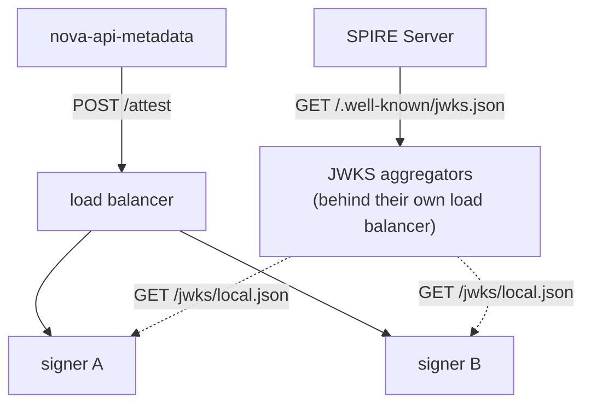

# Topology: signers plus aggregators

JWKS aggregators fetch every signer replica's keys and serve them merged; SPIRE Server only reaches the aggregators.

```mermaid
flowchart TB
    nova["nova-api-metadata"] -- "POST /attest" --> lb["load balancer"]
    lb --> a["signer A"] & b["signer B"]
    agg["JWKS aggregators<br/>(behind their own load balancer)"] -. "GET /jwks/local.json" .-> a & b
    spire["SPIRE Server"] -- "GET /.well-known/jwks.json" --> agg
```
