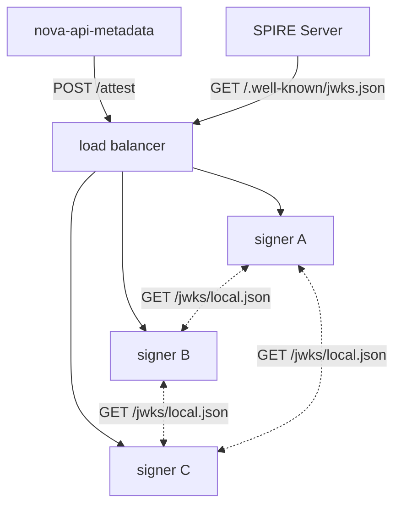

# Topology: peered signers

Each signer replica fetches the others' keys and serves them merged with its own; SPIRE Server fetches the merged set through the signers' load balancer.

```mermaid
flowchart TB
    nova["nova-api-metadata"] -- "POST /attest" --> lb["load balancer"]
    spire["SPIRE Server"] -- "GET /.well-known/jwks.json" --> lb
    lb --> a["signer A"] & b["signer B"] & c["signer C"]
    a <-. "GET /jwks/local.json" .-> b
    b <-. "GET /jwks/local.json" .-> c
    a <-. "GET /jwks/local.json" .-> c
```
