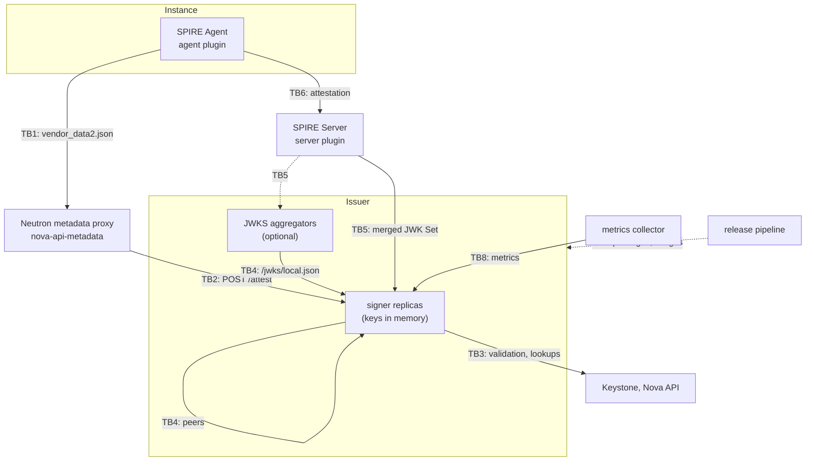

# Data flows and trust boundaries

Every flow of the solution, labelled with the trust boundary it crosses (TB1 to TB8, as in the threat model).

```mermaid
flowchart TB
    subgraph guest["Instance"]
        agent["SPIRE Agent<br/>agent plugin"]
    end
    meta["Neutron metadata proxy<br/>nova-api-metadata"]
    subgraph issuer["Issuer"]
        signers["signer replicas<br/>(keys in memory)"]
        agg["JWKS aggregators<br/>(optional)"]
    end
    os["Keystone, Nova API"]
    server["SPIRE Server<br/>server plugin"]
    collector["metrics collector"]
    release["release pipeline"]

    agent -- "TB1: vendor_data2.json" --> meta
    meta -- "TB2: POST /attest" --> signers
    signers -- "TB3: validation, lookups" --> os
    agg -- "TB4: /jwks/local.json" --> signers
    signers -- "TB4: peers" --> signers
    server -- "TB5: merged JWK Set" --> signers
    server -. "TB5" .-> agg
    agent -- "TB6: attestation" --> server
    collector -- "TB8: metrics" --> signers
    release -. "TB7: packages, images" .-> issuer
```
